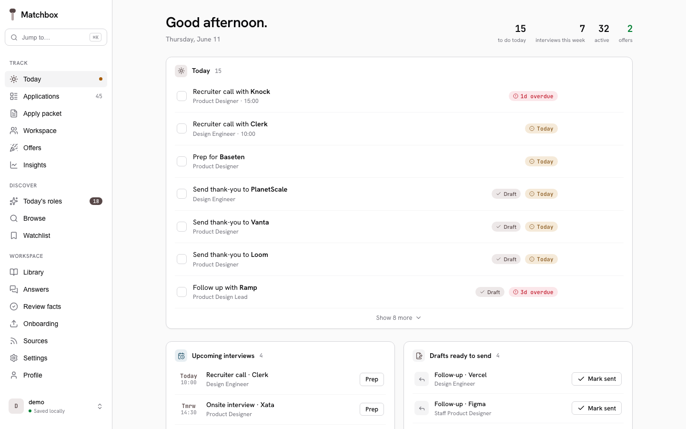
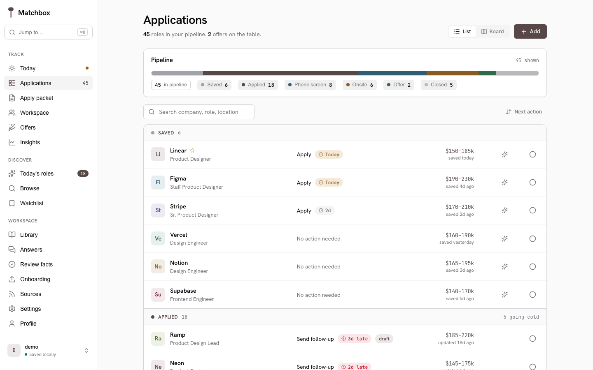
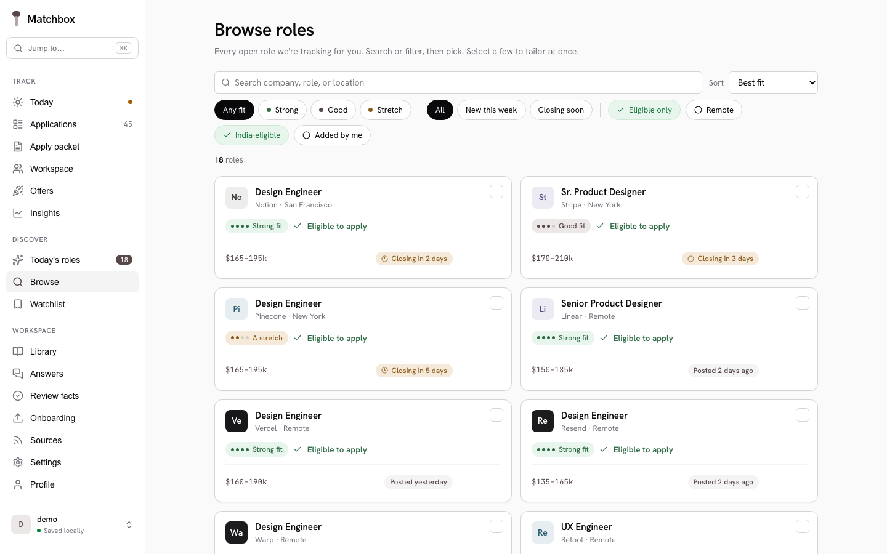

# Matchbox

[](https://github.com/5h1vmani/matchbox/actions/workflows/ci.yml)
[](LICENSE)
[](pyproject.toml)
[](pyproject.toml)
[](https://github.com/astral-sh/ruff)

> Local desktop app that turns your career history into a verified fact
> library, scans ATS boards for matching roles, and tailors a CV per job
> with Claude Code as the reasoning engine. The AI can only select from
> facts you confirmed: it cannot invent a word of your CV. Your data
> stays on your laptop, and Matchbox holds no LLM credentials.



<p align="center">
  
  
</p>

*(Screens above run in sample mode: `/?sample` renders the whole app
with built-in demo data.)*

## How it works

Two halves joined by a file-based handoff:

* **The app** (this repo): SQLite, a FastAPI JSON API + React single-page UI,
  ATS pollers, deterministic scoring, HTML/weasyprint PDF rendering. Ships no
  LLM credentials of its own.
* **The brain**: parses your old CVs, extracts JD requirements, selects which
  verified bullets go on each CV and writes the tailored summary, polishes
  wording. Two ways to run it, same contracts and the same validation gates:
  * **In-app with your own key** (simplest): add an Anthropic or OpenAI key in
    Settings and use "Parse my files in-app" / "Run in app" — the localhost
    server calls the API with your key and streams progress. The key lives in
    a local 0600 file, never in the browser, never shipped.
  * **[Claude Code](https://claude.com/claude-code)** (no key in the app):
    paste the prompts the UI shows you; Claude Code drives the CLIs
    (`matchbox-ingest`, `matchbox-jobreqs`, `matchbox-assemble`) through the
    versioned JSON contract in `runs/` and `schemas/`.

Selection (which verified bullets land on a CV, plus the tailored summary
and headline) is the brain's judgement, but the deterministic core
*validates* it: every id must be a real verified bullet and the summary
clears the voice gate before anything renders, so selected text is never
fabricated. With no model available, a deterministic matcher (BM25 +
embeddings + MMR) picks instead (the offline fallback). The brain does the
irreducible judgement: parsing messy input, extracting requirements,
selecting and wording, optional polish.

## Prerequisites

Supported on macOS and Linux natively. On Windows, three options, best
first: (1) WSL2 — everything works out of the box; (2) native Windows with
the Chromium PDF backend — `pip install "matchbox[chromium]"`, then
`playwright install chromium` and set `MATCHBOX_PDF_BACKEND=chromium`
(no GTK needed); (3) Docker — `docker build -t matchbox . && docker run
--rm -p 127.0.0.1:8765:8765 -v "$PWD/people:/app/people" matchbox`.

* Python 3.12+ (3.13 supported and tested)
* Node.js + npm, to build the web UI once (`cd frontend && npm run build`)
* weasyprint for PDF rendering. It is a declared dependency (pulled in by
  `pip install -e ".[dev]"`) but needs system Pango/Cairo at runtime:
  `brew install pango` (macOS) or the libpango/libcairo packages on
  Debian/Ubuntu (see the apt step in `.github/workflows/ci.yml`).
* [Claude Code](https://claude.com/claude-code) installed and runnable
  from your terminal. Note: Claude Code requires a paid Anthropic plan or
  API credits; it is the reasoning engine for parsing and tailoring. The
  app itself never talks to an LLM API directly and holds no credentials.

One-command setup (installs deps, builds the UI, then diagnoses your
environment): `./scripts/setup.sh`. To check an existing install at any
time: `matchbox-doctor`.

## Install

With [uv](https://docs.astral.sh/uv/) (recommended; the repo ships a
`uv.lock`, so this is reproducible):

```bash
git clone https://github.com/5h1vmani/matchbox.git
cd matchbox
uv sync
```

Then prefix commands with `uv run` (e.g. `uv run matchbox-web`). macOS
note: if weasyprint cannot load Pango at runtime, `brew install pango`
and use the system Python: `UV_PYTHON_PREFERENCE=only-system uv sync`.

Or with plain pip:

```bash
pip install -e ".[dev]"
```

Build the frontend SPA the server serves (the server returns HTTP 503
"SPA not built" until you do):

```bash
cd frontend && npm install && npm run build
```

For UI development use `npm run dev` instead. Vite serves the SPA and
proxies `/api` to the FastAPI process on `:8765`.

The first time `matchbox-assemble` runs it downloads a ~30 MB ONNX
embedding model (`BAAI/bge-small-en-v1.5`) via `fastembed`.

## Quickstart (sample mode: 2 minutes; first real run: 15-25 minutes)

```bash
matchbox-web                  # starts http://127.0.0.1:8765
```

Open `http://127.0.0.1:8765`. Want to see the app working before you
feed it your data? Open `http://127.0.0.1:8765/?sample`. Every screen
renders with built-in sample data, nothing is written.

The whole app is one React SPA; an empty profile lands you on the
**Onboarding** screen:

1. **Onboarding.** Drag in old CVs (PDF/DOCX), LinkedIn exports, plain
   text notes, anything that describes your work. Or paste freeform
   text. Files stage into `inbox/` on this machine.

2. **Run Claude Code on the staged files.** Open a terminal in the
   repo, start `claude` (or your Claude Code launcher), and paste the
   prompt the page shows you:

   ```text
   ingest my files
   ```

   The brain reads `inbox/`, extracts experiences and bullets and
   skills, writes them to your DB via `matchbox-ingest`. Rows land
   with `facts_verified = false`.

3. **Review.** Open the **Review** screen. Read every bullet. Fix
   wording. Delete noise. Confirm what is true. Only confirmed bullets
   are eligible for CV tailoring.

4. **Targets.** Inside the **Profile** screen. Role families, dream
   companies, locations, exclusions.

5. **Sources.** The **Sources** screen. Add a company by ATS type (Greenhouse,
   Lever, Ashby, SmartRecruiters, Recruitee) and slug. Click
   "Test the slug" before saving to verify the endpoint. Click
   "Scan all enabled" to fetch jobs. See
   [docs/supported-ats.md](docs/supported-ats.md) for live-verified
   example slugs per vendor. Workable is deferred (their public
   no-auth API was removed by the vendor).

6. **Triage.** The **Discover** surface in the SPA. The six-dimension
   rubric scores every new job; per role: Skip, Dismiss, Track, or send
   to a tailoring run. Eligibility and fit are shown honestly; ineligible
   roles are set aside, not hidden.

7. **Process the run.** A new `runs/<id>/work-queue.json` is on disk.
   Copy the prompt the page shows you, paste into Claude Code:

   ```text
   process run 2026-05-22-001
   ```

   The brain processes each job: extracts requirements via
   `matchbox-jobreqs`, runs `matchbox-assemble` to render the PDF,
   writes `status.json` as it progresses. The CV PDF, coverage report,
   and a `changes.md` diff land under `runs/<id>/output/<job>/`.

8. **Review run + apply.** The **Apply packet** (4 tabs) shows each CV
   inline, the coverage bands (covered / partial / uncovered) with
   uncovered must-haves left empty, the cover letter (regenerate live
   with your own key, or via the manual handoff), reusable answers, and
   a Submit that records the application at `applied` with a +7d
   follow-up reminder.

## Architecture (one screen)

```text
inbox/                  user drops files                        app stages
runs/<id>/              app writes work-queue.json              brain reads
                        brain writes status.json                app polls

people/<slug>/matchbox.db    one SQLite DB per profile
shared/rubric.json           deterministic six-dimension job scoring
shared/voice-rules.json      polish-pass guardrails
schemas/*.v1.json            JSON Schema contracts
src/matchbox/
  core/                      DB, models, library CRUD
  onboarding/                ingest CLI
  discovery/                 ATS pollers + scan runner
  scoring/                   rubric + run creation
  matching/                  embed, BM25, RRF, MMR, coverage
  polish.py                  voice-rules-validated keyword alignment
  templates/html/            cv.html (weasyprint); cover HTML is built inline in render_html.py
  web/                       FastAPI JSON API (the React SPA lives in frontend/;
                             the retired Jinja/HTMX UI is under archive/jinja/)
  assemble.py                select (brain's --selection, validated; else the
                             matcher) + render orchestrator
  jobreqs.py                 brain's requirements writer
```

## Commands

```bash
matchbox-web                                          # web UI on 127.0.0.1:8765
matchbox-ingest --file payload.json                   # brain writes the library
matchbox-jobreqs save --job 42 --file reqs.json       # brain saves JD requirements
matchbox-assemble --run <run-id> --job 42             # render CV (fallback matcher selects)
matchbox-assemble --run <run-id> --job 42 \
    --selection selection.json                        # brain's bullet ids + tailored summary
matchbox-assemble --run <run-id> --job 42 --cover     # render cover letter
matchbox-assemble --run <run-id> --job 42 \
    --polish polish.json                              # apply the polish pass
```

CLAUDE.md at the repo root tells Claude Code how to drive these.

## Privacy: what stays local

Everything personal is gitignored, so a public fork or clone of this
repo never carries user data:

* `people/`: one directory per profile (the SQLite DB, rendered CVs).
  Only the `people/demo/` placeholder is committed.
* `inbox/`: files you drop in during onboarding.
* `runs/`: work queues and rendered run artifacts.
* `archive/`: local archived material.

Your documents, the DB, and every rendered PDF stay on your machine.
The committed examples under `docs/examples/` use a fictional persona.
Matchbox holds no LLM credentials; Claude Code runs under your own
account.

## Security

Single-user local tool. No auth. No CSRF. The web server binds to
`127.0.0.1` only (ADR-0005). Do not expose to the network. The PDF
serving route is sandboxed to `runs/<id>/output/<job-id>/` with
path-traversal guards.

## Documentation

* [Testing guide](docs/testing-guide.md): step-by-step runbook for
  testers (shortcut + real flow)
* [Supported ATS](docs/supported-ats.md): per-vendor live status with
  verified example slugs
* [v0.3 design](docs/v0.3-design.md): the design document this build
  follows
* [Live-fire walkthrough](docs/examples/livefire-walkthrough.md): the
  end-to-end verification record
* [Decision records](docs/decisions/): durable architectural choices
* [Contributing](CONTRIBUTING.md)
* [Security policy](SECURITY.md)
* [Changelog](CHANGELOG.md)

Earlier versions of the docs (architecture, cli-reference, ux-design,
setup, troubleshooting, operator-runbook, index) lived under `docs/`.
They described v0.2 and now sit under `archive/v0.2/docs/`. v0.3
documentation is the README plus `docs/v0.3-design.md` plus this
section.

## License

MIT. See [LICENSE](LICENSE).
